<center> <h2>DATACLASS IN PYTHON </center><hr>
<right><h5>Presented by Ertony Basilwango Master1 Artificial Intelligence  at DIT</h5></right>
 
 
 
 
<h3> 0. Motivation</h3>

<font face= Times New Roman > The choice of the subject is driven by the fact that dataclass is a new exciting feature 
introduced in python 3.7, seemingly to be a breakthrough feature, this module is a 
straight-forward of the decorator. My work on this particularly project helped me to grasp 
not only what's dataclass mean and how it functions but also to fill the gap about my shortcomings
comprehension of a decorator and its magic functions. As it sounds by its name, everything thing about dataclass is more than magic.
</font>


<center> 

 

**It takes a village to raise a child (African proverb)** 
</center>

#### Table of content 

<font size=3>

+ Define a class using dataclasses
+ Use default attributes and their rules
+ Create a representation method
+ Compare data classes
+ Sort data classes
+ Use inheritance with data classes
+ Work with immutable data classes 

</font>


1. **Introduction**<br>

<font face = candara, size=3>Python is an incredibly versatile, expansive language which, due to its similarity to 
everyday language, is surprisingly easy to learn even for inexperienced programmers. It 
has seen a huge increase in popularity since the release it's open-source. this allow its huge community to 
develop features constantly. Thereof, in this paper i am going to talk about dataclass, one of the most amazing and awesome 
feature recently launched.

When creating classes to work only as data containers, writing Dunder, magic methods[Documentation here](https://docs.python.org/3/howto/regex.html)( such as the __init__ method repeatedly can
generate a great amount of work and potential errors. The data classes module, a feature introduced in Python 3.7, provides a way to create data classes in a simpler
manner without the need to write methods. In this article, we’ll see how to take advantage 
of this module, its concept and theories, alternative solutions, pros and cons ant ultimately I will let you draw the conclusion


*What is dataclass ?* A dataclass is a module introduced in Python 3.7 that allows you to quickly define classes that are
primarily used to store data. It provides a decorator @dataclass that adds automatically generated special methods to 
the class, such as __ init __(), __ repr __(), __ eq __(), and __ hash __(), making it easier to create and work with simple classes.
Dataclasses alleviates this problem while providing additional useful methods under the hood. # Moreover, 
since dataclasses is relatively new in the Python ecosystem, it enforces modern practices such as type annotations.


Here is an example of how to define a simple data class:
<table><tr><td  bgcolor = "black" color = white >Note: This code, as well as all other examples in this paper, will only work in Python 3.7 and above.
This research is done under python 3.11 version</td></tr></table>

>Note: This code, as well as all other examples in this paper, will only work in Python 3.7 and above.
This research is done under python 3.11 version

```python
from dataclasses import dataclass

@dataclass
class Tatavoiture:
    town:str
    distance: float
    pricekm: float
```
If we use the dataclasses module, we need to import dataclass to use it as a decorator in the class we’re creating.
I have defined a Tatavoiture class that has three class variables: town of type str, distance of type float and pricekm
of type float.When the dataclass decorator is applied to the class, it automatically generates 
the __init__(), __repr__(), __eq__() as well as other functions as we are going to see further in this paper.

When we define a class to store some attributes, it usually goes something like this.

```python
class Tatavoiture:
    def __init__(self, town:str, distance:float, pricekm:float):
        self.town = town
        self.distance = distance
        self.pricekm = pricekm

    def __repr__(self):
        return (f'{self.__class__.__name__}'
                f'(Town ={self.town!r}, distance= {self.distance!r}, {self.pricekm!r})')

    def __eq__(self, other):
        if other.__class__ is not self.__class__:
            return NotImplemented
        return (self.town, self.distance, self.pricekm) == (other.town, other.distance, other.pricekm)
```
This is much more code to write, you can already see signs of boilerplate pain. town, distance and pricekm are 
all repeated three times to initialize an object.

The equivalent of this block of use using data class would be like this:

```python
from dataclasses import dataclass

@dataclass
class Tatavoiture:
    town:str 
    distance: float
    pricekm: float
```

If we use the inspectmodule to check what methods have been added to my class Tatavoiture, 
we can see the __ init __ , __ eq __ and __ repr __ methods: these methods are responsible for setting
the attribute values, testing for equality and representing objects in a nice string format.
```python
from dataclasses import dataclass
import inspect
from pprint import pprint

@dataclass
class Tatavoiture:
    town: str
    distance: bool
    pricekm: float


pprint(inspect.getmembers(Tatavoiture, inspect.isfunction))
```
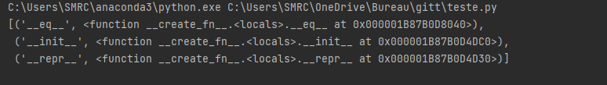

## Module content

Let me introduce dataclasses and what problems they’re designed to solve and go through several nice features they provide. 
I’ll sometimes compare classes written with dataclasses to native Python implementations and spot the differences.

@dataclasses.dataclass(*, init=True, repr=True, eq=True, order=False, unsafe_hash=False, frozen=False, match_args=True, kw_only=False, slots=False, weakref_slot=False)
If dataclass() is used just as a simple decorator with no parameters, it acts as if it has the default values documented in this signature. 

```python

@dataclass()
class Tatavoiture:

@dataclass(init=True, repr=True, eq=True, order=False, unsafe_hash=False, frozen=False,
           match_args=True, kw_only=False, slots=False, weakref_slot=False)
class Tatavoiture:

```
Note that this method is automatically added to the class:

### A look to some Magic or Dunder Methods

Python magic methods are special methods that add functionality to our custom classes. They are surrounded by double underscores [here](https://zetcode.com/python/magicmethods/)


+ The __ init __ method is used to initialize objects. This method is used to implement the constructor of the object. 
+ The __ repr __ method is called by the built-in function repr. It is used on the Python shell when it evaluates an expression that returns an object.
+ The __ add __  methodis used to implement addition operation. In Python, numbers are not primitive literals but objects. The num + 4 expression is equivalent to num.__ add __(4).
+ The __ str __ is used to give a human-readable version of the object and the __repr__ a complete representation of the object. The output of the latter is also more suited for developers.
+ The __ len __ method returns the length of the container. The method is called when we use the built-in len method on the object
+  The __ getitem __ method defines the item access ([]) The __getitem__ method defines the item access 
+ The __ eq __ implements the == operator. The __lt__ implements the < operator and the __ gt __ implements the > operator.

+ The __ add __ method, The --add-- method is used to implement addition operation. In Python, numbers are not primitive literals but objects.
The num + 4 expression is equivalent to num.--add--(4)

+ The __ del __When an instance object is about to be  destroyed, the __del__ method is called. 
This gives you the chance to do any kind of cleanup that may be required. This might be closing files, 
or disconnecting network connections. After this code is completed, the object is finally destroyed  and resources are freed.

Note there are many other methods we can use here as aforementioned earlier, but in our case we highlight only the most used, 
most importantly related to data classes for further datails  [documentation](https://realpython.com/primer-on-python-decorators/)

### Custom representations of the objects

##### The __ repr __ method
As we mentioned earlier, dataclass implements not only the __init__ method, but several others, including the __repr__ method. 
In a regular class, we use this method to display a representation of an object in the class.
```python

class Tatavoiture:
    def __init__(self, town:str, distance:float, pricekm:float):
        self.town = town
        self.distance = distance
        self.pricekm = pricekm
        
        
v1 = Tatavoiture("Dakar", 12.5, 900)
print(v1.pricekm)
# we try to print 
print(v1)
# We initialize the object
print(v1 == Tatavoiture("Dakar", 12.5, 900))
```
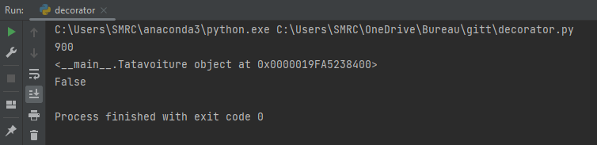

additionally you realize that the representation of the objects is not very descriptive.
We notice that V1 is quite different to Tatavoiture("Dakar", 12.5, 900)

To remdiate to this drama we have to use a dunder method __ equal __ or its equivalent 

```python
class Tatavoiture:
    def __init__(self, town:str, distance:float, pricekm:float):
        self.town = town
        self.distance = distance
        self.pricekm = pricekm

    def __eq__(self, other):
        if other.__class__ is not self.__class__:
            return NotImplemented
        return (self.town, self.distance, self.pricekm) == (other.town, other.distance, other.pricekm)
        
        
v1 = Tatavoiture("Dakar", 12.5, 900)
print(v1.pricekm)
# we try to print 
print(v1)
# We initialize the object
print(v1 == Tatavoiture("Dakar", 12.5, 900))  
```
We notice that this is so much work, by the time this can be done by a data class in a short time.

Let us throw a glance at what can be it equivalent when we use @dataclass decorator
```python
from dataclasses import dataclass

@dataclass
class Tatavoiture:
    town: str
    distance: float
    pricekm: float


print(Tatavoiture('Kinshasa', 1.27, 2000.0))
```
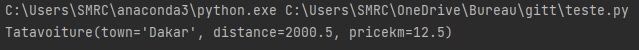

Ofcourse, dataclass is helping us out behind this. By default, dataclass implement a --repr--() method to provide a 
nice string representation. Once the class is defined, it’s easy to instantiate a new object and access its attributes, 
just like with a standard class. This representation can be overridden to implement any custom message you want.
These example proves sufficiently the benefit of using data class, As we can see the output is now more comprehensive more than it is used to be, 
not only the code is shorter but also it offers more readability and better code maintainability


### different way of using modules

We can also set default values to the class attributes:As a reminder, Python doesn’t accept a non-default attribute after default in both class and functions, so this would throw an error:

##### Support default values 

You can add default values to each attribute while preserving the annotation.
```python
from dataclasses import dataclass

@dataclass
class Tatavoiture:
    town:str = 'Dakar'
    distance: float = 2000.5
    pricekm: float = 12.5

print(Tatavoiture())

```


So far we’ve used regular data types like string, integer, and float; we can also combine dataclass with the 
typing modules to create attributes of any kind in the class. 
For instance, let’s add a dimension attribute to the Tatavoiture

```python
from dataclasses import dataclass
from typing import Tuple

@dataclass
class Tatavoiture:
    town: str
    distance: float
    pricekm: float
    year: int
    dimension: Tuple


print(Tatavoiture('Kinshasa', 1.27, 2000.0,2019, (3.235, -1.999)))
```

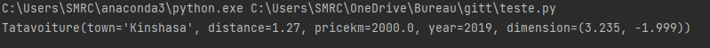


##### Representation and Comparisons

When it comes to comparisons, the dataclasses module makes our lives easier. For example, we can directly compare 
two instances of a class just like this:

```python
from dataclasses import dataclass

@dataclass
class Tatavoiture:
    town: str
    distance: float
    pricekm: float
    

v1 = Tatavoiture("Dakar", 12.5, 900)
print(v1 == Tatavoiture("Dakar", 12.5, 900))
```
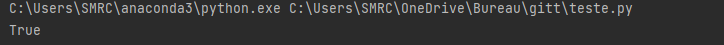

Notice that the output of the representation is customized. The comparison is valid because the dataclass creates
behind the scenes an __eq__ method, which performs the comparison.  However, when you define a class using the 
standard Python syntax and test for the equality between two instances that have the same attribute values, 
here’s what you’d get:
```python
class Tatavoiture:
    def __init__(self, town:str, distance:float, pricekm:float):
        self.town = town
        self.distance = distance
        self.pricekm = pricekm
        
v1 = Tatavoiture("Dakar", 12.5, 900)
print(v1 == Tatavoiture("Dakar", 12.5, 900))
```
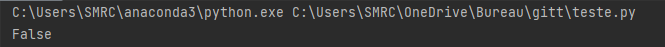

Without the use of the dataclass decorator, that class doesn’t test whether two instances are equal.
So, by default, Python will use the object’s id to make the comparison, and, as we see below, they are different: 
All this means that we’d have to write an __eq__ method that makes this comparison:

```python

class Tatavoiture:
    def __init__(self, town:str, distance:float, pricekm:float):
        self.town = town
        self.distance = distance
        self.pricekm = pricekm


    def __eq__(self, other):
        if other.__class__ is not self.__class__:
            return NotImplemented
        return (self.town, self.distance, self.pricekm) == (other.town, other.distance, other.pricekm)
```


### The @dataclass Parameters

> As we saw above, when using the dataclass decorator, the __init__, __repr__, and __eq__ methods are implemented for us.
The creation of all these methods is set by the init, repr, and eq parameters of dataclass.
These three parameters are True by default. If one of them is created inside the class, then the parameter is ignored.

Let us see what are others parameters a data class can have :*


frozen: When True, the values inside the instance of the class can’t be modified after it’s created. The default is False. (=Insert link==>>>link to documentation)

There are a few other methods that you can check in the documentation.However, we are going to give so much attention on these two:


##### Sorting parameter

Order  enables sorting of the class as we’ll see in the this section. The default is False.
When working with data, we often need to sort values. In our scenario, we may want to sort our different 
Tatavoiture based on some attributes. For that, we’ll use the order parameter of the dataclass decorator 
mentioned above which enables sorting in the class:

```python
from dataclasses import dataclass

@dataclass(order=True)
class Tatavoiture:
    town: str
    distance: float
    pricekm: float
```
When the order parameter is set to True, it automatically generates the __ lt __ (less than), 
__ le __ (less or equal), __ gt __ (greater than), and __ ge __ (greater or equal) methods used for sorting.
Let’s instantiate our v1 and v2 objects to see if one is greater than the other:

```python
v1 = Tatavoiture("Kigali", 1700, 1050.0)
v1 = Tatavoiture("Nairobi", 2500, 1000.5)
print(v1>v2)
```


Python tells us that Kigali is not greater than Nairobi, but based on what criteria? The class compares the objects as tuples containing their attributes, like this:
```python

print(("Kigali", 1700, 1050.0) > ("Nairobi", 2500, 1000.5))

```


As the letter "K" comes before "N", it says the Kigali < Nairobi. If the names were the same, it would move to the next 
element in each tuple. As it is, it’s comparing the objects alphabetically. 
Although that can make some sense depending on the problem we’re dealing with,
we want to be able to control how the objects will be sorted.

<table><tr><td  bgcolor = "teal">Note: You may ask the question, what if you want to sort our object by their distance?</td></tr></table>

Well, to achieve that we have to take advantage of these two features;

##### Field feature

that is used to customize one attribute of a data class individually, 
which allows us to define new attributes that will depend on another attribute 
and will only be created after the object is instantiated. And 

In our sorting problem, we’ll use field to create a sort_index attribute in our class. 
This attribute can only be created after the object is instantiated and is what dataclasses uses for sorting:

```python
from dataclasses import dataclass, field

@dataclass(order=True)
class Tatavoiture:
    sort_index: int =field(init=False, repr=False)
    town: str
    distance: float
    pricekm: float
```
The two arguments that we passed as False state that this attribute isn’t in the __ init __ 
and that it shouldn’t be displayed when we call __ repr __. 

##### __ post __ int __
 
After we’ve referenced this new attribute, we’ll use the second new tool __ post _ int __ 
this method is executed right after the __ init __ method to define the sort_index, right after the creation of the object.
As an example, let’s say we want to compare v1 and v2 based on their distance.

```python
@dataclass(order=True)
class Tatavoiture:
    sort_index: int =field(init=False, repr=False)
    town: str
    distance: float
    pricekm: float
    
    def __post_init__(self):
        self.sort_index = self.distance
```
If we make the same comparison, we know that V1 is not greater than V2:

```python
v1 = Tatavoiture("Kigali", 1700, 1050.0)
v2 = Tatavoiture("Nairobi", 2500, 1000.5)
print(v1>v2)
```


The distance is False, as we all know that the distance 2500 is greater than 1700. if we want to compare the pricekm 
we will repeat the same process.

```python
@dataclass(order=True)
class Tatavoiture:
    sort_index: int =field(init=False, repr=False)
    town: str
    distance: float
    pricekm: float
    
    def __post_init__(self):
        self.sort_index = self.pricekm
        
v1 = Tatavoiture("Kigali", 1700, 1050.0)
v2 = Tatavoiture("Nairobi", 2500, 1000.5)
print(v1 > v2)
```


### unsafe_hash

Mutability is a complicated property that depends on the programmer’s intent,by default, dataclass() will not implicitly add
a __ hash __() method unless it is safe to do so. If __ hash __() is not explicitly defined, or if it is set to None, then dataclass() may add an implicit __ hash __() method. Although not recommended, you can force dataclass() to create a __ hash __() method with unsafe_hash=True. This might be the case if your class is logically immutable but can nonetheless be mutated.

```python
from dataclasses import dataclass, field

@dataclass(order= True, unsafe_hash=True)
class Tatavoiture:
    sort_index: int = field(init=False, repr=False)
    town: str
    distance: float
    pricekm: float

    def __post_init__(self):
        self.sort_index = self.pricekm


v1 = Tatavoiture("Kigali", 1700, 1050.0)
v2 = Tatavoiture("Kigali", 1700, 1050.0)
v3 = Tatavoiture("Nairobi", 2500, 1000.5)
print(hash(v1))
print(hash(3))
```
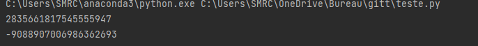
We obviously notice that the objects have different hash

```python
v1 = Tatavoiture("Kigali", 1700, 1050.0)
v2 = Tatavoiture("Kigali", 1700, 1050.0)
v3 = Tatavoiture("Nairobi", 2500, 1000.5)
print(hash(v1))
print(hash(3))
```

### Frozen instances

Another parameter of @dataclass that we mentioned above is frozen. When set to True, frozen doesn’t allow us 
to modify the attributes of an object after it’s created. With frozen=False, we can easily perform such modification:
Using dataclasses, you can create objects that are read-only. 
All you have to do is set the frozen argument to True inside the @dataclass decorator.

```python
from dataclasses import dataclass

@dataclass
class Tatavoiture:
    town: str
    distance: bool
    pricekm: float

v1 = Tatavoiture("Dakar", 12.5, 900)
v1.distance = 22.5
print(v1)
```
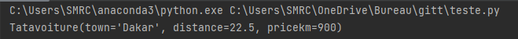

We created a Person object and then modified the age attribute without any problems. 
However, when set to True, any attempt to modify the object throws an error:

```python
from dataclasses import dataclass

@dataclass(frozen=True)
class Tatavoiture:
    town: str
    distance: bool
    pricekm: float

v1 = Tatavoiture("Dakar", 12.5, 900)
v1.distance = 22.5
print(v1)
```

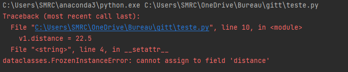

** Notice that the error message states FrozenInstanceError.**

There’s a trick that can modify the value of the immutable data class . If our class contains a mutable attribute, 
this attribute can change even though the class is frozen.
When you do this, you prevent anyone from modifying the values of the attributes once the object is instantiated.
If you try to set a frozen object’s attribute to a new value, a FrozenInstanceError error will be raised.

## Inheritance with dataclasses

The dataclasses module also supports inheritance, which means we can create a data class that uses the attributes 
of another data class. Still using our Tatavoiture, we’ll create a new Driver class that inherits all the attributes
from Tatavoiture.

```python

@dataclass
class Tatavoiture:
    town: str
    distance: float
    pricekm: float
    year: int
```
And the new Employee class:

```python
from dataclasses import dataclass

@dataclass
class Driver(Tatavoiture):
    name: str
    num: int
    salary: float
```
Now we can create an object of the driver class using all the attributes of theTatavoiture class

```python 
print(Driver("Libreville", 450.5, 1500, "Mr Patrick", 20345094, 2000000.0))
```
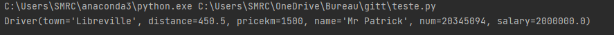


#### KW_ONLY

coming in Python 3.10, there's a new dataclasses.KW_ONLY sentinel that works like this:

```python
from dataclasses import dataclass, KW_ONLY

@dataclass(kw_only=True)
class Tatavoiture:
    town: str
    distance: float
    pricekm: float


v1 = Tatavoiture("Dakar", 12.5, 900)
print(v1.town)

```

now when we try to create an instance of dataclass without specifying keyword args, we will get an exception because it is expecting the keyword args.

```python
from dataclasses import dataclass, KW_ONLY

@dataclass(kw_only=True)
class Tatavoiture:
    town: str
    distance: float
    pricekm: float


v1 = Tatavoiture(town = "Dakar", distance = 12.5, pricekm = 900)
print(v1.town)

```
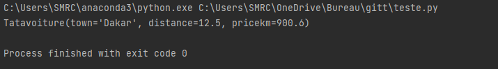


## Data classes alternatives

In the next section, we'll take a look at other alternatives, some of which you may have already encountered. For simple data structures, you've probably already used a tuple or a dictionary.

#### Dictionary and tuple alternative

Presenting data structures you've probably already used a tuple or a dictionary. 
Using the dictionary or tuple you could represent the Tatavoiture in either of the following ways
```python
Tatavoiture_tuple = ("Dakar", 12.5, 900)
Tatavoiture_dict = {"town":"Dakar","distance":12.5,"pricekm":900}
print(Tatavoiture_tuple)
print(Tatavoiture_dict)
```
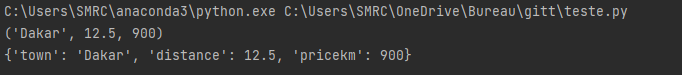

This does work, but it puts a lot of responsibility on you as a program, 

+ Tuple 
For the tuple version, you need to remember the order of attributes, this definitely means that you have 
to remember that Tatavoiture_tuple variable represent what throughout your lines code. 
The problem with tuple and dictionaries is, it does work really but puts a lot of responsibility on your programmer.
With tuple we need to remember the order of the attributs.
Writing a space before Dakar like this " Dakar" will mess up your program, but probably not give you an easily understandable 
error message

+ dictionary
For the DICT version, you must make sure the names of the attributes are consistent.
```python
Tatavoiture_dict = {"town": "Dakar", "distance": 12.5, "pricekm": 900}
Tatavoiture_dict2 = {"town": "Kinshansa", "distance": 12.5, "pricekm": 900}
```
The example shown on screen would not work as expected. Furthermore, using these structures is not ideal. 
The tuple does not give us named access and the DICT version doesn't give named attribute lookup.

```python
Tatavoiture_tuple = ("Dakar", 12.5, 900)
Tatavoiture_dict = {"town": "Dakar", "distance": 12.5, "pricekm": 900}
print(Tatavoiture_tuple[0])
print(Tatavoiture_dict['distance'])
```
+ A named Tuple
A better alternative is the names tuple. It's long been used to create readable, small data structures, and you 
can in fact recreate the data class example already seen using a named tuple as seen on screen. 
This definition of named tuple card will give this same output as the data class card seen earlier on did

```python
from collections import namedtuple

NamedTupleTata = namedtuple("NamedTupleTata", ["town", "distance", "pricekm"])
Tatavoiture = NamedTupleTata("Dakar", 12.5, 900)
print(Tatavoiture.town)
print(Tatavoiture)
print(Tatavoiture == NamedTupleTata("Dakar", 12.5, 900))
```


This definition of namedTupleTata will give you the same output as the dataclass seen earlier. 
> * So why even bother with data classes? 

First of all, data classes come with many more features that you've seen already.
At the same time, the NameTupleTata has some other features that are not necessarily desirable. By design a named tuple
is a regular tuple which can be illustrated by this comparison seen on screen. While this might seem like a good thing,
this lack of awareness about its own type can lead to subtle and hard to find bugs, especially since it will happily 
compare two different named tuple classes.<br>

```python
from collections import namedtuple

NamedTupleTata = namedtuple("NamedTupleTata", ["town", "distance", "pricekm"])

v1= namedtuple("v1", ["model", "size", "kilometrage"])
v2 = NamedTupleTata("Dakar", 12.5, 900)
print(v2 ==v1("Dakar", 12.5, 900))
```


Furthermore, Named tuple also come with some restrictions. For instance, it's hard to add default values to some of the fields in the name to. The named tuple is also by nature immutable. 

```python
v2.town = "Kinshasa"
```
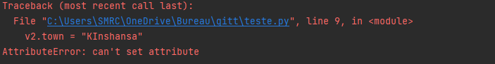

By the value of Named tuple could never changed In some applications this is an awesome feature, but in other settings it would be nice to have more flexibility.

### The Attrs Project alternative

Another alternative and one of the inspirations for data classes is the Attrs Project. With Attrs installed as seen here. You can write a card class as follows. 

+ first, we have to install attrs module
    
This is what it looks

```python
import attr

@attr.s
class Tatavoiture:
    town = attr.ib()
    distance = attr.ib()
    pricekm = attr.ib()

v1 = Tatavoiture("Dakar", 12.5, 8000.5)
print(v1.town)
print(v1)
print(v1==Tatavoiture("Dakar", 12.5, 8000.5))
```
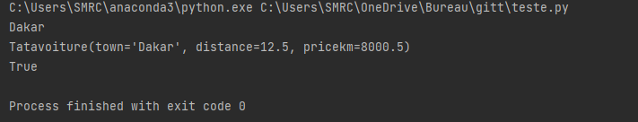

The Actors Project does support some features that data classes do not include in converters and validators.
Furthermore, actors has been around for a while and is supported in older versions of Python. But that is isn't part
of the standard library, and as such it would add an external dependency to your projects. If you use data classes, 
similar functionality will be available everywhere without external dependencies.


**In addition to Tuple, NamedTuple and attrs,fields seen in this paper, there are other similar projects including typing.NamedTuple, attrdict, plumber, that we will progressively add to this project**


## CONCLUSION

In some applications this is an awesome feature, but in other settings it would be nice to have more flexibility.

In this article, we have been able to highlight how the dataclasses module is a very powerful tool to create data classes in a quick, intuitive way. Although we’ve seen a lot in this article, the module contains many more tools, and there’s always more to learn about it. 

The dataclass() decorator will add various “dunder” methods to the class, described below. If any of the added methods already exist in the class, the behavior depends on the parameter, as documented below. The decorator returns the same class that it is called on; no new class is created.

> * So far, we’ve learned how to:
>* Define a class using dataclasses
>* Use default attributes and their rules
>* Create a representation method
>* Compare data classes
>* Sort data classes
>* Use inheritance with data classes
>* Work with immutable data classes


## REFERENCES<hr>


+ The python book, Richmond House, Aoron Asadi, Ross andrew 
+ Learning Python Fourth Edition, Mark Lutz published by O'Reilly
+ Practical Python Pro for beginners and experts, Jonathan Yates
+ https://docs.python.org/3/library/dataclasses.html?highlight=dataclasses#module-dataclasses
+ https://peps.python.org/pep-0557/ | Eric V. Smith eric@trueblade.com 2017
+ [https://zetcode.com/python/magicmethods/](https://zetcode.com/python/magicmethods/) March 4,2023
+ https://docs.python.org/3/library/dataclasses.html
+ https://realpython.com/python-data-classes/
+ https://dev.to/dbanty/you-should-use-python-dataclass-lkc
+ https://dev.to/isabelcmdcosta/dataclasses-in-python-are-nice-1fff
+ https://youtu.be/vBH6GRJ1REM
+ https://youtu.be/vRVVyl9uaZc
+ https://www.attrs.org
* https://www.youtube.com/watch?v=Ivqr-lfwQc4
+ https://pypi.org/project/fields