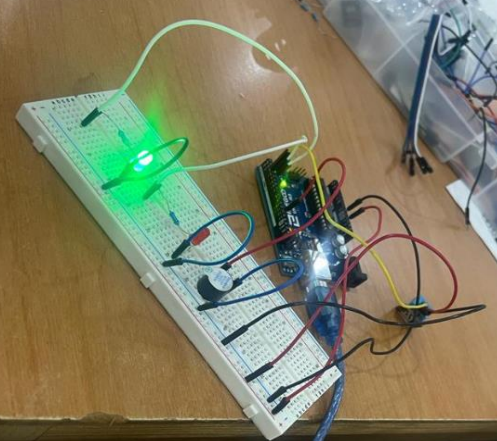
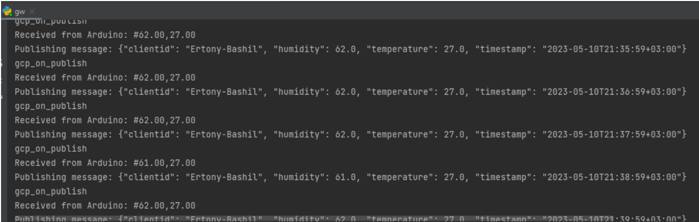
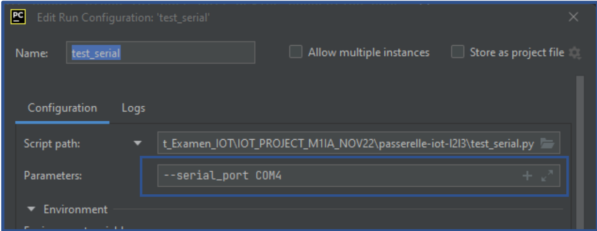
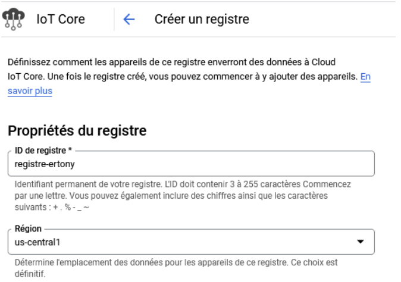
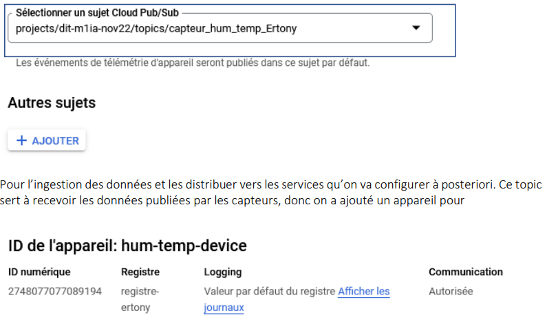
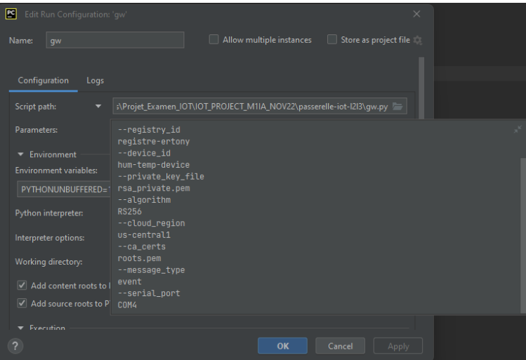
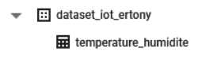
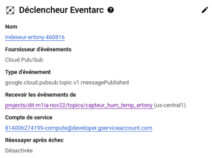

# IoT application for assessing weather-related health risks
<hr><br>

IoT application for assessing weather-related health risks. prediction and evaluation the impact of 
weather on human health. The connected object (humidity and temperature sensor) collected weather 
data then sent it to the gateway on the cloud platform, Cloud IoT Core processed, stored and analyzed
the weather data and managed the devices (connected objects) then BigQuerry stored the data, 
created and executed machine learning models.

<h2>1. Collecte des données</h3>

Les données métrologiques sont collectées à partir d’une carte électronique de prototypage rapide 
Arduino UNO sur laquelle on a raccordé un capteur numérique de température et d'humidité DH11
qui mesure l'air ambiant et crache un signal numérique sur la broche de données.

 

```c++
void setup() {
   Serial.begin(9600);
   dht.begin();
}
  
void loop() {
   // Lire la valeur de l'humidité et de la temperature
  float humidite = dht.readHumidity();
  float temperature = dht.readTemperature();
  // Vérifier si la lecture a échouée
  if (isnan(humidite) || isnan(temperature)) {
    Serial.println("Echec de lecture depuis le capteur DHT11");
  return;
  }

  Serial.println("#" + String(humidite) + "," + String(temperature));
  delay(60000);

}
```

Le programme Arduino permettant de récupérer la valeur de température et d’humidité du capteur 
DHT11 et envoyer les mesures à la passerelle toutes les 60 secondes.



Avant de recevoir ce message, nous avons à priori créé une Passerelle L2/L3 pour communiquer via le 
protocole série UART avec le nœud capteur (Arduino). La passerelle est constituée d’un script Python 
qui lie sur l’interface USB les données série envoyées par le nœud capteur (Arduino). Ce script python 
est configuré de manière à communiquer sur un numéro spécifique de port avec Arduino. Pour notre 
cas c’était serial port 4



Nous avons ensuite créé un registre qui contient notre appareil connecté hum-temp-device qu’on a 
créée et authentifié : Les données recueillies depuis ce nœud capteur sont transférées à IoT Core qui 
a enregistré le nœud capteur par le biais de la passerelle L2/L3.



Cloud IoT Core achemine les messages de l'appareil vers Cloud Pub/Sub afin de les regrouper. Les 
messages sont acheminés vers le sujet sujets hum-temp-device-ertony Cloud Pub/Sub




Pour des raisons de sécurité il faillait authentifier notre device, pour s’assurer que les données reçues
sont bel et bien de notre nœud Arduino et que nos données sont seulement reçues par google. A partir 
du code source gen.py, une clé publique privé est générée. Cette clé est collée dans la partie
authentification de l’appareil

====> 

La clé RS256_X509 s'affiche sur la page Informations sur l'appareil de votre appareil
Une fois l’appareil ajouté dans le registre Cloud IoT Core, on a notre passerelle en exécutant le script 
gw.py tout en spécifiant les paramètre de notre registre, registre, le numéro de port et autres.




<h2>2. Stockage des données </h3>

Après la collecte des données suis passé au stockage des données, Dans le menu des services GCP,
suis parti à la rubrique ANALYSE dans le service BigQuerry j’ai créé un dataset nomé 
ertony_iot_iot_ertony en précisant la région us-central1(Lowa) puis j’ai créé une table pour stocker 
les données recueillies.

Une fois mon dataset créé, j’ai éventuellement créée une table que j’ai nommé
temperature_humidite pour stocker les mesures brutes de température et d’humidité



Dans Cloud Function : j’ai créé une fonction seconde génération, région : la région us-central(Lowa), 
que j’ai nomé indeur-ertony qui s’exécute un code le code python à chaque fois qu’une données est 
publiée par un capteur au niveau du registre. La fonction a comme topic hum-temp-device-ertony un 
sujet auquel on s’est aboné. 
Partie configuration de la fonction : 



Partie code de la fonction. Le fichier main.py contient les contenues de la fonction et le 
requirements.txt contient les dépendances de du script pythons

```python

import functions_framework
import base64
import json
from google.cloud import bigquery
from google.cloud import iot_v1

@functions_framework.cloud_event
def handle_dht11_data(cloud_event):
  # Parameters - Cloud IoT Core
  project_id = cloud_event.data["message"]["attributes"]["projectId"]
  cloud_region = cloud_event.data["message"]["attributes"]["deviceRegistryLocation"]
  device_id = cloud_event.data["message"]["attributes"]["deviceId"]

  # Personalized parameters - BigQuery
  dataset = "dataset_iot_prenom"  # change prenom suffix by your name
  table = "temperature_humidite"

  # Pub/Sub data
  data = base64.b64decode(cloud_event.data["message"]["data"]).decode("utf-8")
  data_dict = json.loads(data)
  rows_to_insert = [{
    "device_id": device_id,
    "temperature": data_dict["temperature"],
    "humidite": data_dict["humidity"],
    "timestamp": data_dict["timestamp"]
  }]

  # Insert data on BigQuery
  bq_client = bigquery.Client()
  table_id = bigquery.Table.from_string(f"{project_id}.{dataset}.{table}")
  errors = bq_client.insert_rows_json(table_id, rows_to_insert)
  if errors:
    print(f"Encountered errors while inserting rows: {errors}")
    ```
    
    


